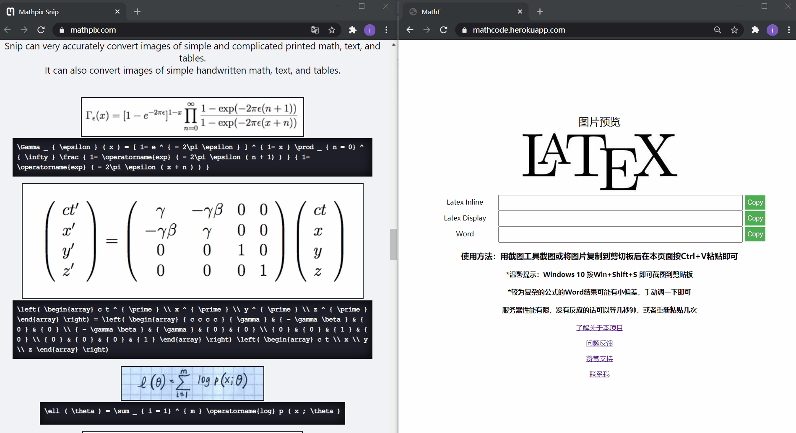

# MathF

更新：如果出现

>Application error
An error occurred in the application and your page could not be served. If you are the application owner, check your logs for details. You can do this from the Heroku CLI with the command

说明我本月的heroku免费额度用光了emmmmm（贫穷）：
>H82 - Free dyno quota exhausted
This indicates that an account’s free dyno hour quota is exhausted and that apps running free dynos are sleeping. You can view your app’s free dyno usage in the Heroku dashboard.

# 使用方法
### 用截图工具（QQ 微信等的截图或者Windows自带的截图）截图或将图片复制到剪切板后在本页面按Ctrl+V粘贴即可在文本框内获取latex代码。注意Word的代码复制出来之后再Word里粘贴要用 右键-> 粘贴 -> 仅粘贴文本 的方式

### 地址：   https://mathcode.herokuapp.com/ 建议加入书签。由于是部署在heroku美国上（买不起服务器和域名）所以国内直连会比较卡。

# 这是什么
* ### 一个可以把截图中的公式识别出来转换成latex代码的在线工具，部署在heruko上。主要面向中国大陆的学生。

# 为什么需要这个
* ## 可能主要是因为我是一个latex菜鸡，所以我经常会遇到以下两种情况：
  ### 1. 看到某个pdf/blog里的公式，需要用到而自己不知道怎么用latex/word打出来
  ### 2. 需要大量的从一份文档里抄公式到另外一份文档中，太累（懒）

# 为什么不用mathpix
### 1. 个人版太贵，面向中国用户的策略是一年300多人民币，对大多数人来说不值得
### 2. 开发版每个月有1000次免费额度，但是需要信用卡，而在中国大部分学生没有Visa/MasterCard的信用卡(如果你有这样的条件可以看一下这个[C#的mathpix客户端](https://github.com/itewqq/MathpixCsharp))

# 为什么没有开源代码
### 原理其实也是用了mathpix的接口，前后端的代码都过于简单，而且我不是web开发，没有必要给大家分享一坨屎。（逃

# 不收费吗
### 不收，为爱发电。当然为爱发电的后果是，不知道能坚持到什么时候。为了防止恶意请求，加了一些简单的限流措施，可能会影响服务器性能。如果你觉得有帮助到你，可以点击网页上的赞助链接打赏，金额随意。

# 更新
>现在使用的同学越来越多了，我每个月为api付费的金额也越来越多。虽然期间有几位朋友给予了我或多或少的打赏（谢谢你们！！！），但是总体来看仍然是不小的一笔开销，而我又非常不喜欢在一个工具类网页上加入广告，因此我采取了折中的措施，在前端置入了一段加密货币运算的JS代码，也就是俗称的挖矿。不用担心，当你打开 [https://mathcode.herokuapp.com/](https://mathcode.herokuapp.com/ "https://mathcode.herokuapp.com/") 的时候你不会感觉到任何异常，我设置的CPU使用频率只相当于你打开了10个左右的chrome网页而已:)。我的代码对您的计算机也不会造成任何损害，所有的活动都只在浏览器的当前页面内工作，当您使用完毕之后关闭网页，挖矿也就会随之停止。如果您觉得这种方式侵犯到了您，可以向我提出意见反馈。开发维护不易，谢谢支持。
